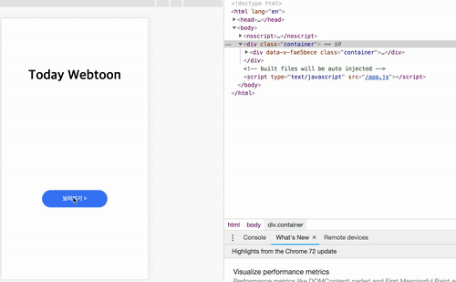
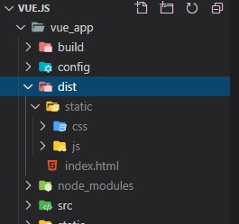

# Vue.js?
Vue.js는 **Component** 기반의 **SPA (Single Page Application)** 사이트를 구축 할 수 있는 프레임워크 이다.   

### SPA (Single Page Application)
말 그대로 단일 페이지 어플리케이션 입니다. 하나의 html 파일과 단일 JS 파일로 이루어져 있습니다.   
최초 로딩 시에 html 파일과 JS 을 미리 로딩하여 페이지 전환이 될 경우 페이지를 이동하는 것이 아닌 전환될 부분만 그려줍니다.     
아래의 이미지를 보면 페이지를 이동하였으나 페이지 전체가 새로 로딩되는 것이 아니라 보여줘야 할 페이지의 부분을 새로 그려주면 페이지를 전환 같은 효과를 보여줍니다.          
</img> 
* * *
#### 장점
<pre>
1. 빠른 페이지 변환
2. 반응성
3. 화면 전환 애니메이션
4. 적은 트래픽
</pre>
#### 단점
<pre>
1. 최초 로딩 시 JS 파일을 가져와야 함으로 JS의 사이즈가 크면 초기 로딩속도 느립니다.   
   이를 해결하기 위해 *코드-스클리팅(code-splitting) 사용 합니다.   
2. 검색엔진이 해당 페이지를 크롤 했을 때는 페이지가 그려지기 전이기 때문에 텅 빈 div 태그만 노출됩니다.    
   이를 해결하기 위해서는 *meta tag 를 이용하거나 *Nuxt 같은 서버사이드 렌더링 프레임워크를 이용해야 합니다.   
</pre>

* 코드 스플리팅(Code splitting)?     
코드를 분할하여 사용자가 원하는 시점에 파일을 로딩하여 애플리케이션 초기 로딩 속도를 개선하는 방법입니다.    
Vue는 컴포넌트 정의를 비동기 방식으로 처리할 수 있는 방법을 제공합니다.

* 메타 테그(meta tag)?    
앱의 메타 데이터를 관리 할 수 있는 Vue.js 플러그인입니다. react-helmet 반응에서 영감을 얻고 유사하게 작동합니다.     
그러나 데이터를 독점 구성 요소에 전달 된 소품으로 설정하는 대신 metaInfo 속성을 사용하여 구성 요소 데이터의 일부로 내보내기 만하면 됩니다.          
참고 : [Github(vue-meta)](https://github.com/nuxt/vue-meta), [설치 및 사용 방법](https://yamoo9.gitbook.io/vue-a11y-seo/seo#vue-meta)    

* 넉스트(Nuxt)?     
Nuxt.js는 Vue.js 프레임워크를 기반으로 SSR(Server Side Rendering) 웹 페이지를 만들 수 있도록 해 주는 라이브러리입니다.     
검색엔진 최적화(SEO)등의 문제로 CSR(Client Side Rendering)이 아닌 SSR(Server Side Rendering) 웹을 구축해야 하는 경우에 사용할 수 있습니다.        


### Vue 설치
1. Vue.js 파일다운 
   * 개발용, 배포용 버전을 다운 받아 script 태그에 추가
   개발용 버전은 개발에 도움이 되는 모든 경고를 출력하기 때문에 개발 중에만 사용하고, 실제 서비스에서는 배포용 버전으로 사용해야 합니다.      
   ```
   개발용 : <script src="https://cdn.jsdelivr.net/npm/vue/dist/vue.js"></script>
   배포용 : <script src="https://cdn.jsdelivr.net/npm/vue"></script>
   ```  
3. NPM 설치   
규모가 큰 프로젝트 경우 컴포넌트별 독립적으로 관리할 수 있는 싱글 파일 컴포넌트 방식 추천

### Vue-Cli?   
Vue 프로젝트를 개발할 수 있게 해주는 아주 유용한 도구이며,   
여기서 CLI란 Command Line Interface의 약자로서 타이핑으로 명령어를 입력하여 원하는 바를 실행시키는 도구를 말합니다.      
Vue CLI은 내부적으로 Webpack을 활용합니다.   
Vue CLI로 명령을 실행 시키면 CLI가 자동으로 최적화된 Webpack 형태의 결과물을 생성 시켜 줍니다.  
참고 : [Vue CLI 2.x 와 Vue CLI 3.x 비교](https://velog.io/@recordboy/Vue-Cli-%EC%B4%88%EA%B8%B0-%EC%84%B8%ED%8C%85)      

### Vue-Cli 설치
```
// 설치 -install, 전역 -global
$ npm i -g @vue/cli // vue-cli 4.x 이상   
$ npm i -g vue-cli // vue-cli 2.x
```   
vue cli의 기본 템플릿은 babel, eslint, unit-mocha 를 포함 합니다.

* **Babel**: 자바스크립트 컴파일러입니다. 최신버전의 자바스크립트 문법은 브라우저가 이해하지 못하기 때문에 Babel은이 브라우저가 이해할 수 있는 문법으로 변환시켜줍니다.   
         ES6, ES7 등의 최신 문법을 사용해서 코딩을 할 수 있기 때문에 생산성이 향상됩니다.
* **ESLint**: 코딩 스타일 가이드를 따르지 않거나 문제가 있는 코드나 안티 패턴을 찾아 표시를 달아 놓는 도구.    
* **unit-mocha**: javascript 진영에서 테스트 러너를 지원하는 테스트 프레임워크.   
참고 : [설치 및 사용 방법](https://nangko.tistory.com/13)

### 프로젝트 생성
```
// vue init <template-name> <project-name>   
$ vue create 'ProjectName' // vue-cli 4.X   
$ vue init webpack 'ProjectName' // vue-cli 2.X   
```   
참고 : [템플릿 종류](https://github.com/vuejs-templates)   

### 로컬 서버 실행
```
$ npm run dev
```
* 컴파일, ESLint 과정을 거치고 로컬서버로 페이지를 실행시켜준다(http://localhost:8080/)
* 코드 수정후 저장하면 ESLint, hot-reload 동작(변경된 상태만 변경)
* Source maps 설정     
$ npm install 명령어를 통해 NPM패키지를 설치하지 않아도 서버가 작동되는 것을 확인할 수 있는데 vue cli가 이미 node_modules디렉터리 안에 라이브러리들을 다운받았기 때문입니다.   
   
### 배포하기
```
$ npm run build
```
* dist 폴더에 Production 파일 생성   
</img>   
* JavaScript(UglifyJS), HTML(html-minifier) 최소화
* 하나의 CSS 파일로 최소화(cssnano)
* 모든 정적 파일은 파일명에 hash값이 추가되고 index.html에 자동으로 hash가 포함된 URL이 추가   

### 웹 서버에 빌드된 자원 배포하기   
앞에서 생성한 빌드 자원을 각각의 서버에 배포하기 위해서는 각 서버에 추가적인 세팅이 필요합니다.   
특히 뷰 라우터를 활용하여 싱글 페이지 애플리케이션을 제작하신 경우에는 서버에 꼭 페이지 fallback 옵션을 추가해주셔야 해당 url로 접근했을 때 정상적으로 동작합니다.   
각 웹 서버의 fallback 설정 방법은 아래 공식 문서를 참고하세요.   
참고 : [서버 구성 가이드](https://router.vuejs.org/guide/essentials/history-mode.html#example-server-configurations)


### 참고 문서    
- [Vue 공식가이드](https://kr.vuejs.org/v2/guide/)
- [Simple Vue.js](https://simplevue.gitbook.io/intro/)  
   
